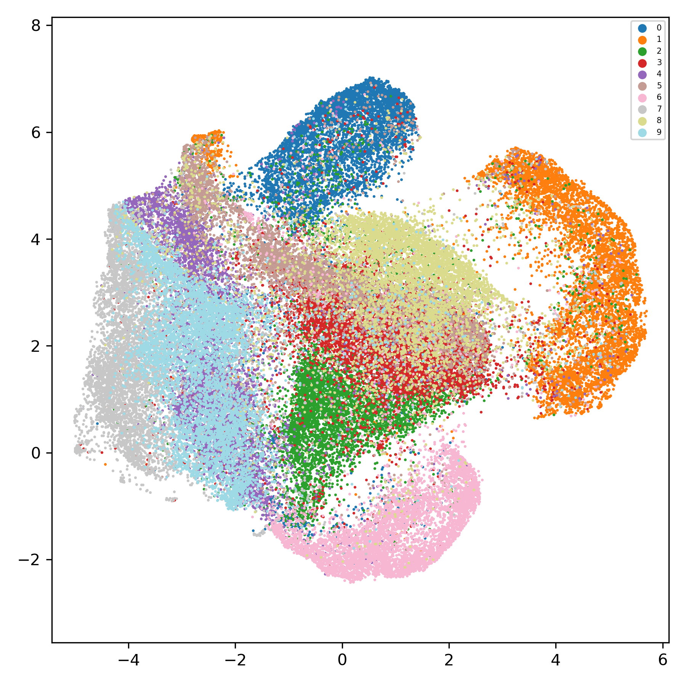

ClusterGAN fork for climate data experiments.

This repository is mostly based on the repository [ClusterGAN: A PyTorch Implementation](https://github.com/zhampel/clusterGAN) which in turn is based on the [Tensorflow implementation](https://github.com/sudiptodip15/ClusterGAN) of [ClusterGAN](https://arxiv.org/abs/1809.03627)


## Requirements

This codebase is developed within the following environment:
```
python 3.6.9
pytorch 1.5.0
matplotlib 3.1.3
tqdm 4.47.0
numpy 1.18.1
seaborn 0.10.1
torchvision 0.6.0
```

In `umap-project.py`, we also use GPU-enabled implementation of [UMAP](https://arxiv.org/abs/1802.03426) available in [RAPIDSAI](https://rapids.ai/) suite of open source software libraries and APIs. The line responsible for that is the following:

```
from cuml import UMAP
```

One can replace it with the [standard implementation](https://umap-learn.readthedocs.io/en/latest/) simply replacing the line with the following:

```
from umap import UMAP
```

in which case, one needs to ensure [`umap-learn`](https://umap-learn.readthedocs.io/en/latest/) package is installed.


## Run ClusterGAN on MNIST

We narrowed the scope of the applications to MNIST only (so far). So the running of ClusterGAN on the MNIST dataset one may use the following command:
```bash
CUDA_VISIBLE_DEVICES=gpu_id python train.py --run-name=test_run --batch-size=64 --epochs=500 --num-workers=16 --snapshots-period=15 --latent-dim=32 --cat-num=10
```
where `gpu_id` is an id of a GPU to use (for example, `0`);

As a result, a directory `./logs/run_name` will be made and contain the generated output (models, generated examples, training figures) for the training run.

Options for the script `train.py`:


|  option      |  description       |
|--------------|--------------------|
|`--run-name`  | run name (str, default='test_run')|
|`--batch-size`| batch size (int, default=64)|
|`--epochs` | number of training epochs (int, default=200)|
|`--wass-metric` | Flag for Wasserstein metric (the flag is True if option is set)|
|`--num-workers` | Number of dataset workers (int, default=1)|
|`--snapshots-period` | period (in epochs) for saving the snapshots of models (int, default=-1 for saving final models only)|
|`--latent-dim` | real embeddings dimensionality (int, default=32)|
|`--cat-num` | categorical embeddings dimensionality, number of categories (int, default=10)|


### Encoding examples

Next, one may want to apply the encoder network to a data. This script may be useful in this case:

```bash
CUDA_VISIBLE_DEVICES=gpu_id python encode.py --run-name=test_run --snapshot-final --num-examples=60000 --batch-size=512 --dataset-train --dataset-workers=16
```

or the following:
```bash
CUDA_VISIBLE_DEVICES=gpu_id python encode.py --run-name=test_run --snapshot-stage=100 --batch-size=512 --dataset-workers=16
```

As a result, the encoded data file *.npz will be saved in the directory of the run, e.g., `./logs/test_run/mnist_train_stage-final_encoded.npz` or `./logs/test_run/mnist_train_stage-ep0135_encoded.npz`. The file contains three named arrays: `zn`, `zc_logits`, and `labels`  for the real embeddings part of the examples, the categorical part, and for the true labels of the examples.

Options for the script `encode.py`:

<table width="100%">
  <tr>
    <td width="30%"><b>option</b></td>
    <td><b>description</b></td>
  </tr>
  <tr>
    <td><code>--run-name</code></td>
    <td>run name (str, default=<code>'test_run'</code>)</td>
  </tr>
  <tr>
    <td><code>--snapshot-final</code></td>
    <td>Flag for using the final snapshot of the models (default behaviour). This option is mutually exclusive with the option <code>--snapshot-stage</code></td>
  </tr>
  <tr>
    <td><code>--snapshot-stage</code></td>
    <td>stage of training (epoch, <code>int</code>) for loading models snapshot (most close one will be involved in case there is no snapshots for this exact epoch);<br /><code>-1</code> means the last one except final one. This option is mutually exclusive with the option <code>--snapshot-final</code> and <code>--snapshot-all</code> </td>
  </tr>
  <tr>
    <td><code>--snapshot-all</code></td>
    <td>encode dataset using all the snapshots made during training. This option is mutually exclusive with the option <code>--snapshot-final</code> and <code>--snapshot-stage</code></td>
  </tr>
  <tr>
    <td><code>--num-examples</code></td>
    <td>number of examples (int; default is not set, in which case the whole dataset will be encoded)</td>
  </tr>
  <tr>
    <td><code>--batch-size</code></td>
    <td>batch size for the inference</td>
  </tr>
  <tr>
    <td><code>--dataset-train</code></td>
    <td>The flag indicating the encoding either of the training (if set) subset of data, or test subset (if not set, which is the default behaviour)</td>
  </tr>
  <tr>
    <td><code>--dataset-workers</code></td>
    <td>number of workers preprocessing dataset</td>
  </tr>
</table>


#### UMAP dimensionality reduction

Next, one may want to apply UMAP to the encoded data. This script may be useful in this case:

```bash
python umap-project.py --run-name=test_run --file-path=./logs/test_run/mnist_train_stage-ep0135_encoded.npz
```

options for the script `umap-cluster.py`:

<table width="100%">
  <tr>
    <td width="30%"><b>option</b></td>
    <td><b>description</b></td>
  </tr>
  <tr>
    <td><code>--run-name</code></td>
    <td>run name (str, default=<code>'test_run'</code>)</td>
  </tr>
  <tr>
    <td><code>--file-path</code></td>
    <td>encodings file path. This option is mutually exclusive with the option <code>--files-all</code></td>
  </tr>
  <tr>
    <td><code>--files-all</code></td>
    <td>cluster using encodings of all available training stages (each stage separately). This option is mutually exclusive with the option <code>--file-path</code></td>
  </tr>
</table>


As a result, the UMAP dimensionality reduction will be applied to the encodings, and the plot will be placed in the file, e.g., `./logs/test_run/umap-mnist_train_stage-ep0135_encoded.png`. Here is an example of this plot:

</img>